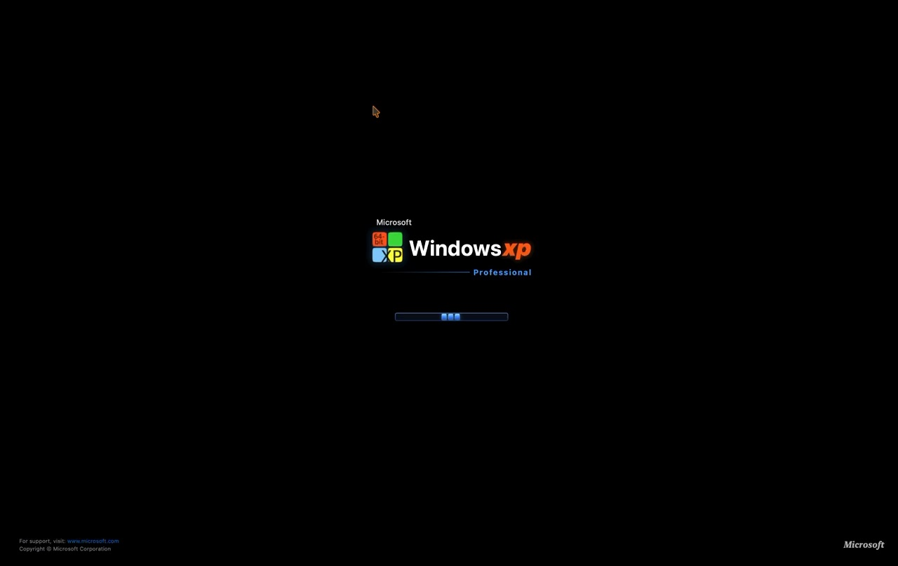

# MacXP 🪟

> **The Nostalgic Windows XP Experience, Reimagined as a Native macOS Application.**

MacXP is a standalone, pixel-accurate recreation of Microsoft Windows XP (Luna Blue theme) built entirely in Swift and SwiftUI for macOS 13.0+ (Ventura, Sonoma, and Sequoia). It brings the golden era of desktop computing back to life with an authentic boot screen, desktop, window manager, start menu, taskbar, sound engine, and a complete suite of classic built-in applications.

---

## 🎬 Demo Video

Watch MacXP in action:

https://github.com/SecH0us3/macxp_os/releases/download/v1.0.0/demo.mp4

<p align="center">
  <video src="https://github.com/SecH0us3/macxp_os/releases/download/v1.0.0/demo.mp4" poster="docs/assets/poster.jpg" controls="controls" width="100%" style="max-width: 800px; border-radius: 8px; box-shadow: 0 8px 24px rgba(0,0,0,0.3);">
    <a href="https://github.com/SecH0us3/macxp_os/releases/download/v1.0.0/demo.mp4">
      
    </a>
    <p><em>Click image or link above to play the demo video.</em></p>
  </video>
</p>

> 🎥 **Download Video:** [`demo.mp4` (HD 720p)](https://github.com/SecH0us3/macxp_os/releases/download/v1.0.0/demo.mp4) | 📦 **Latest Release:** [MacXP v1.0.0](https://github.com/SecH0us3/macxp_os/releases/tag/v1.0.0)

---

## ✨ Key Features

### 🚀 Authentic Windows XP Boot Screen
- **Classic Black Boot Screen**: High-resolution *Microsoft Windows XP Professional* branding with glowing 4-color Windows flag.
- **The Famous Running Blue Cubes**: Continuous smooth animation of the 3 glowing blue loading blocks gliding across the progress track.
- **Seamless Startup**: Automatically fades into the desktop while playing the iconic **Windows XP Startup Sound**.
- **Auto Fullscreen**: Launches directly in full-screen immersion.

### 🏞️ Iconic Desktop & Bliss Wallpaper
- **Procedural & Original Bliss Wallpaper**: Faithful vector rendering and original high-res Bliss landscape with lush rolling green hills and puffy clouds.
- **Authentic XP System Icons**: Original icons for *My Computer* (classic CRT monitor + PC tower), *My Documents*, *Recycle Bin*, and *Internet Explorer*.
- **Marquee Selection**: Multi-icon rubberband drag selection with authentic translucent blue selection rectangle (`#316ac5`).
- **Context Menus**: Right-click desktop menu with *Arrange Icons*, *Refresh*, *New Folder*, *New Text Document*, and *Display Properties*.

### ⚡ Macromedia Flash Player & Flash Games
- **Macromedia Flash Player 8 Interface**: Authentic player frame with the iconic red Flash logo, menu bar (`File`, `View`, `Control`, `Help`), and the legendary **Flash Right-Click Context Menu** (*Zoom In*, *100%*, *Quality: High*, *About Flash Player 8*).
- **Built-in Nostalgic Flash Games**:
  - **🚁 Copter 2004 (The Helicopter Game)**: Hold mouse / Space to fly up through scrolling green cavern obstacles with live particle smoke trails and distance scoring.
  - **👾 Space Alien Blast**: Retro Flash arcade space shooter with laser cannons, alien waves, and combo scoring.

### 🎨 Authentic Luna Theme & Window Management
- **Luna Blue Window Frames**: Classic rounded royal blue title bars with high-gloss gradients, 3D beveled borders, and authentic close, maximize, and minimize buttons.
- **Multi-Window Desktop**: Drag windows freely across the workspace, resize from 8 directions (edges and corners), and bring windows to front on focus.
- **Cascading Placement**: New windows cascade intelligently when launched.
- **Window Snapping & Maximization**: Maximize windows to fill the work area above the taskbar or restore them to their previous dimensions.

### 🟢 Start Menu & Taskbar
- **Two-Column Start Menu**:
  - Top header with user avatar and macOS username.
  - Left column featuring pinned Internet Explorer, Flash Player, and frequently used applications.
  - *All Programs* flyout menu with categorized accessories, games, and native macOS applications.
  - Right column with shortcuts to *My Documents*, *My Pictures*, *My Music*, *My Computer*, *Control Panel*, *Search*, and *Run...*.
  - Bottom bar with *Log Off* and *Turn Off Computer* dialogs.
- **Luna Taskbar**:
  - Green **start** button with embossed 4-color Windows XP flag (toggled via `Cmd` / `Win` key or click).
  - Active window tabs with pressed/active state styling and click-to-minimize/restore behavior.
  - System tray with real-time digital clock, volume popup slider, and battery indicator.

### 💻 Classic Built-in Applications

| Application | Description |
| :--- | :--- |
| **🗂️ Windows Explorer** | Virtualized `C:\` and `computer://` structure, authentic drive/folder icons, breadcrumb address bar, forward/back history, folder task sidebar (*Other Places*), 5 view modes (Tiles, Icons, List, Details), and file context menus. |
| **⚡ Macromedia Flash Player** | Authentic Flash 8 player with retro Flash games (*Copter 2004*, *Space Alien Blast*), context menu, and .swf game switcher. |
| **🌐 Internet Explorer 6** | Classic IE6 browser with original gold-halo logo, URL address bar with green Go button, back/forward navigation, and live web rendering. |
| **🎵 Windows Media Player** | Authentic skin with audible playback engine, volume control, track seeking, and animated spectrum visualizers with classic tracks (*Like Humans Do*, *XP Tour*, *Beethoven No. 9*). |
| **📝 Notepad** | Lightweight text editor with File (New, Open, Save, Save As), Edit (Undo, Cut, Copy, Paste, Delete, Time/Date `F5`), Word Wrap toggle, and status bar line/column tracking. |
| **🔢 Calculator** | Standard XP calculator supporting memory operations (`MC`, `MR`, `MS`, `M+`), arithmetic (`+`, `-`, `*`, `/`), square root, reciprocal, percentage, and full keyboard control. |
| **🎨 Paint** | Classic raster canvas with Pencil, Brush, Line, Rectangle, Ellipse, and Eraser tools, 28-color palette, brush thickness controls, and Undo history. |
| **⌨️ Command Prompt (`cmd.exe`)** | Real terminal session connected to macOS subprocess with DOS command aliases (`DIR`, `CD`, `CLS`, `ECHO`, `HELP`, `VER`, `PING`, `COLOR`, `EXIT`). |
| **💣 Minesweeper** | Authentic gameplay with Beginner (9x9), Intermediate (16x16), and Expert (30x16) modes, yellow smiley face reaction button, 7-segment digital LED timer, and high scores. |
| **⚙️ Control Panel & System Properties** | Real Mac hardware specs (chip, memory, macOS version) displayed in classic XP System Properties tabs. |
| **🌌 3D Pipes & Starfield Screensavers** | Authentic 3D OpenGL-style Pipes screensaver, retro Starfield warp speed simulation, and Display Properties config dialog. |
| **🚀 Run Dialog** | Quick-launch command dialog (`Win+R`) with persistent history for launching system applications and DOS commands. |
| **🔌 Turn Off Computer** | Modal dialog with Stand By, Turn Off (with shutdown chime), and Restart (with bootscreen reboot). |

### 🔊 Sound Engine
- High-fidelity Windows XP audio:
  - `Startup`: Harmonious chord greeting.
  - `Shutdown`: Descending harmonic resolution.
  - `Navigation`: Crisp tactile click for folders and links.
  - `Error / Hand`: Classic alert chord for invalid actions.
  - `Exclamation / Ding`: High bell chime.
  - `Recycle Bin`: Paper crumple and whoosh on file deletion.
- **Audio Control**: System tray volume popup slider and mute toggle.

### ⌨️ Global Hotkeys & Shortcuts

| Shortcut | Action |
| :--- | :--- |
| **`Cmd`** / **`Win`** | Toggle Start Menu |
| **`Cmd+E`** / **`Win+E`** | Open Windows Explorer |
| **`Cmd+D`** / **`Win+D`** | Show / Hide Desktop (Minimize all windows) |
| **`Cmd+R`** / **`Win+R`** | Open Run Dialog |
| **`Cmd+W`** / **`Alt+F4`** | Close Active Window |
| **`Alt+Tab`** / **`Cmd+Tab`** | Cycle Task Switcher HUD |
| **`F11`** / **`Cmd+Ctrl+F`** | Toggle Fullscreen |
| **`F5`** (in Notepad) | Insert Current Date and Time |
| **`0-9, +, -, *, /, =, Enter, Esc`** | Keyboard calculation in Calculator |

---

## 🛠️ Build & Installation

### Requirements
- **macOS 13.0 (Ventura)** or later (tested on macOS 14 Sonoma & macOS 15 Sequoia)
- **Xcode 15+** or **Swift 5.9+** command line tools

### Quick Start with Make

```bash
# Build the project (debug mode)
make build

# Run all 144 unit tests
make test

# Launch MacXP directly
make run

# Build standalone macOS Application bundle (build/MacXP.app)
make app

# Package into distributable Apple Disk Image (build/MacXP.dmg)
make dmg

# Clean build artifacts
make clean
```

### Manual Swift Package Manager Commands

```bash
# Build release binary
swift build -c release

# Run MacXP
swift run MacXP
```

---

## 📦 Packaging & Distribution

MacXP includes automated packaging scripts in `scripts/`:

- **`scripts/build_app.sh`**:
  - Compiles the release binary with compiler optimizations.
  - Constructs standard macOS `.app` bundle structure:
    - `build/MacXP.app/Contents/MacOS/MacXP`
    - `build/MacXP.app/Contents/Info.plist`
    - `build/MacXP.app/Contents/Resources/AppIcon.icns`
    - `build/MacXP.app/Contents/Resources/Icons/`
    - `build/MacXP.app/Contents/Resources/Sounds/`
  - Applies ad-hoc code signing.

- **`scripts/build_dmg.sh`**:
  - Prepares a staging folder with `MacXP.app` and an `/Applications` drag-and-drop symlink.
  - Generates a compressed `.dmg` disk image at `build/MacXP.dmg`.

---

## 📄 License

This project's source code is free and open source, released under the [MIT License](LICENSE).

---

### Disclaimer
Windows XP, Luna, Bliss, and related assets and visual designs are trademarks and copyrights of Microsoft Corporation. Macromedia and Flash are trademarks of Adobe Systems Inc. This software is an independent, open-source educational, recreational, and nostalgic tribute created for the macOS developer and enthusiast community.

